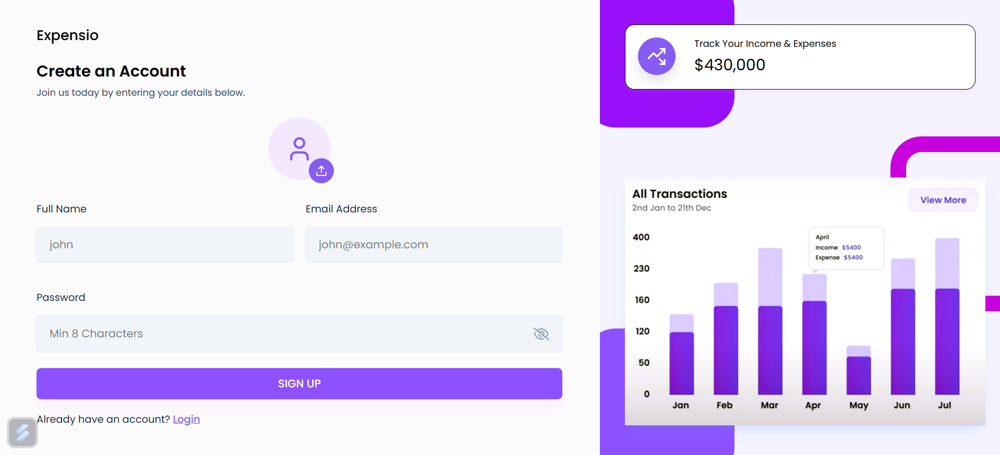
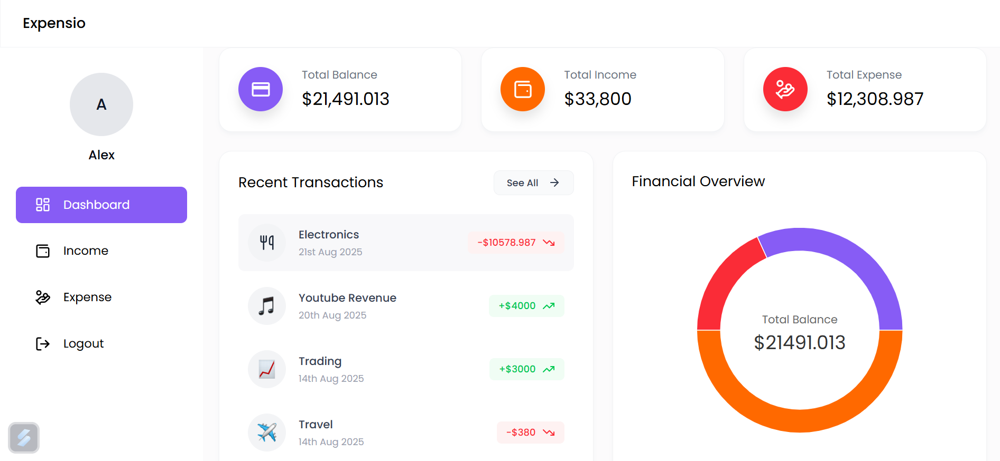
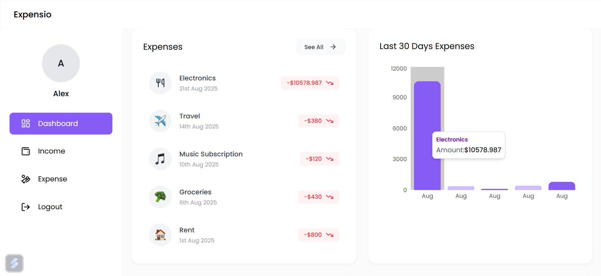
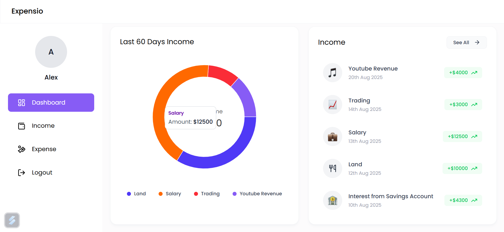
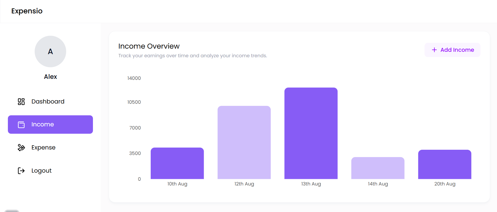
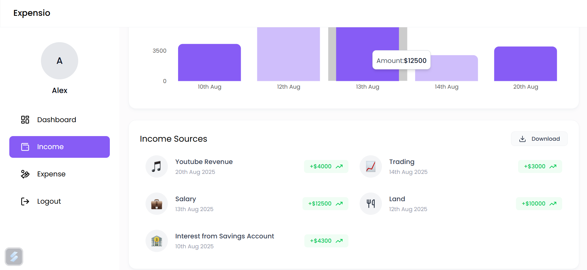
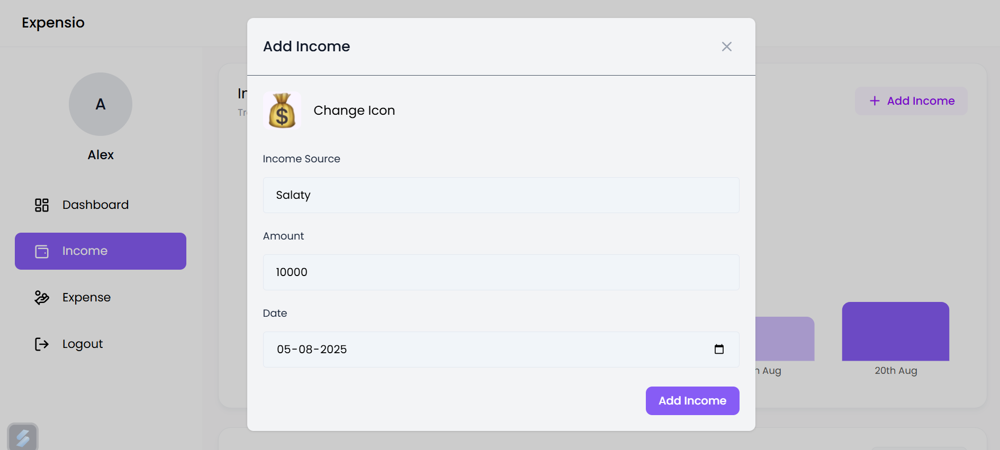
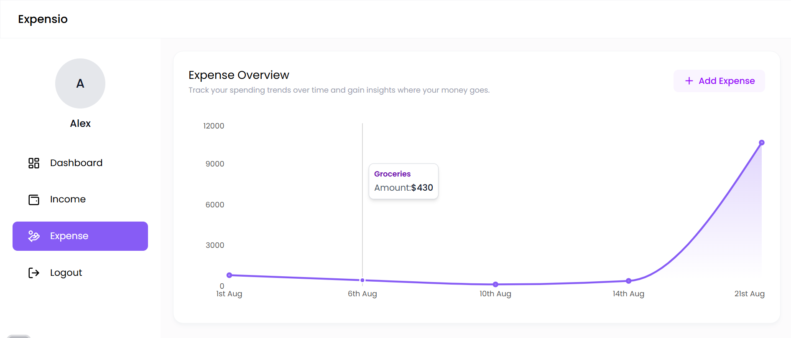
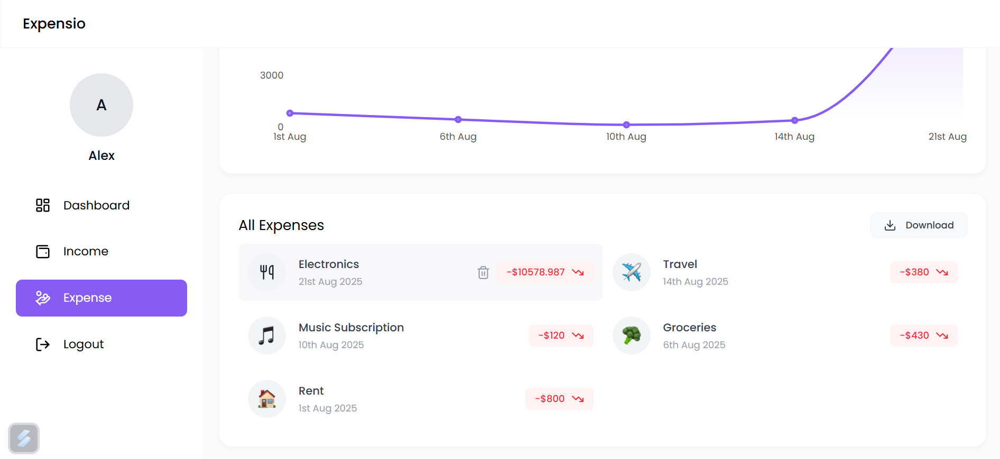
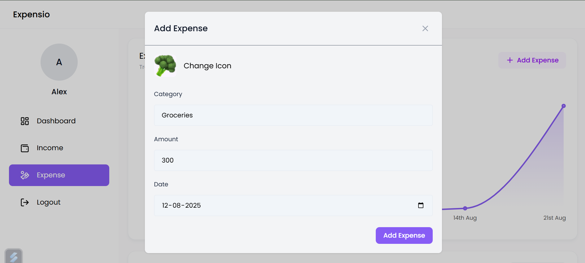

# 💰 Expensio

A simple and intuitive web application to manage your **income** and **expenses**, visualize financial data through dashboards, and keep track of your spending habits.

---

## 📌 Features

- **User Authentication** – Secure login and sign-up using JWT authentication. 
- **Dashboard Overview** – Displays Total Balance, Income, and Expenses in summary cards. 
- **Income Management** – Add, view, delete, and export income sources. 
- **Expense Management** – Add, view, delete, and export expenses with category-based tracking. 
- **Interactive Charts** – Visual representation of income & expenses using Bar, Pie, and Line charts. 
- **Recent Transactions** – Displays the latest income and expense records for quick access. 
- **Expense & Income Reports** – Download all income and expense data in Excel format. 
- **Mobile Responsive UI** – Works seamlessly across desktops, tablets, and mobile devices. 
- **Intuitive Navigation** – Sidebar menu with easy access to Dashboard, Income, Expenses, and Logout. 
- **Delete Functionality** – Hover over income/expense cards to reveal a delete button for easy

---

## 🛠 Tech Stack

- **Frontend:** React.js, Tailwind CSS
- **Backend:** Node.js, Express.js
- **Database:** MongoDB
- **Authentication:** JWT / bcrypt
- **Charting:** Recharts

---

## 📂 Folder Structure

```
Expense_Tracker/
│-- backend/       # Server code, APIs, DB models
│-- frontend/      # UI code
```

---

## 🚀 Installation & Setup

```bash
# Clone the repository
git clone https://github.com/anushshetty20/Expense_Tracker.git

# Navigate to project directory
cd Expense_Tracker

# Install dependencies (frontend & backend)
npm install

# Setup environment variables in .env
PORT=5000
MONGO_URI=your_mongodb_connection_string
JWT_SECRET=your_secret_key

# Start the application
npm run dev
```

---

## 🖼 Screenshots

### 🔐 SignUp



### 🔐 Login


### 📊 Dashboard

  
  


### ➕ Add Income

  

  

### ➖ Add Expense

  

  

---

## 📈 Future Enhancements

- Add recurring expenses/income tracking
- Dark mode toggle

---

## 📜 License

This project is licensed under the **MIT License** – see the [LICENSE](LICENSE) file for details.
